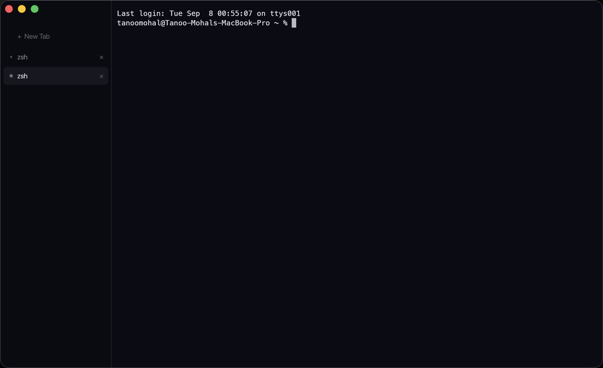

<div align="center">
  
  <h1>Shell</h1>
  <p>A GPU-rendered terminal built around running several coding agents at once.</p>
</div>



## Why

Running three or four agent CLIs in parallel is now normal, and terminals
aren't built for it. You lose track of which tab is which, and — worse — you
can't tell which agent is still working and which one has been sitting there
waiting on your answer for two minutes.

Shell puts that in the window chrome. Tabs label themselves after whatever is
actually running in their pty, agents get identity colors, and a tab that has
gone quiet while you were looking elsewhere tells you so.

## How the detection works

Each tab reads the foreground process group of its pty — `tcgetpgrp`, then
`proc_name` on macOS or `/proc/<pgid>/comm` on Linux. That follows job
control, so it updates when an agent starts, suspends, or exits, and it can't
be spoofed by a program setting its own title escape.

Two things make the raw reading unusable on its own, and both are handled:

- A shell loop or build spawns a rapid succession of short-lived processes, so
  the label would flicker several times a second.
- Agent CLIs shell out constantly, so a `claude` tab would spend most of its
  time labeled after whatever tool the agent just invoked.

So a candidate name has to persist across consecutive polls before it's
adopted, and once a tab is identified as an agent it keeps that identity until
control returns to the shell.

## Design

**Native geometry, authored state layer.** Real window chrome — traffic
lights, system rounding — with a full-size content view so the sidebar reaches
the top. That's the source-list idiom (Xcode, Mail), not a custom frame.

**Two surfaces, one derived from the other.** A theme defines only the
terminal palette. Every chrome color is derived from it, so swapping a theme
restyles the sidebar coherently without the theme knowing the sidebar exists.

**Hue is reserved.** Agent identity owns the only saturated color in the
sidebar. Derived chrome tokens are all neutral mixes of terminal background
and foreground, so a dot stays readable at a glance with six tabs open.

**One state channel each.** Hue carries identity, dot *form* carries activity
(idle / working / waiting), row background carries focus, motion carries
attention. They compose instead of competing.

**Chrome animates; the terminal surface never does.** Animating text costs
perceived latency. There is exactly one animation — a slow pulse on a tab
whose agent is waiting on you — and it runs only while something is actually
waiting.

**A readability floor.** Cell text is held to a minimum WCAG contrast ratio
against the background it landed on, because agent CLIs lean on dim grays
picked against some other palette.

## Themes

`prism` (default, sampled from the app icon) and `prism-light`, which follow
system appearance, plus `graphite`.

Beyond that, Shell reads [Ghostty](https://ghostty.org)'s theme file format —
flat `key = value` text — from `~/.config/shell/themes/`, so palettes already
published for Ghostty work here unchanged.

## Build

Requires a Rust toolchain.

```sh
# macOS: produces target/Shell.app
./scripts/bundle-macos.sh

# Linux: installs to ~/.local by default
./packaging/install-linux.sh

# or just run it
cargo run --release
```

Regenerate icons from source artwork with
`python3 scripts/make-icons.py <artwork.png>`.

## Keys

| | |
|---|---|
| `Cmd/Ctrl+Shift` `T` | New tab |
| `Cmd/Ctrl+Shift` `W` | Close tab |
| `Cmd/Ctrl+Shift` `1`–`9` | Jump to tab |
| `Cmd/Ctrl+Shift` `[` `]` | Cycle tabs |

## Status

Working: truecolor and 256-color, bold/italic/inverse/dim, box drawing, all
cursor shapes, 10k-line scrollback, xterm-correct key encoding including
modifier parameters and application cursor mode, resize, HiDPI, sidebar tabs
with agent detection and attention state, theme system with system-appearance
following.

Not yet: copy/paste, mouse selection, command palette, split panes, session
persistence, configurable font and keybindings. CJK wide characters get one
cell of advance instead of two, and the grid re-shapes each frame rather than
caching glyphs per cell — fine at current redraw-on-demand rates, but it wants
attention before splits multiply the work.

## Built on

[`alacritty_terminal`](https://crates.io/crates/alacritty_terminal) for VTE
parsing, grid, and pty handling · [`winit`](https://crates.io/crates/winit) ·
[`wgpu`](https://crates.io/crates/wgpu) ·
[`glyphon`](https://crates.io/crates/glyphon) for glyph rasterization.
